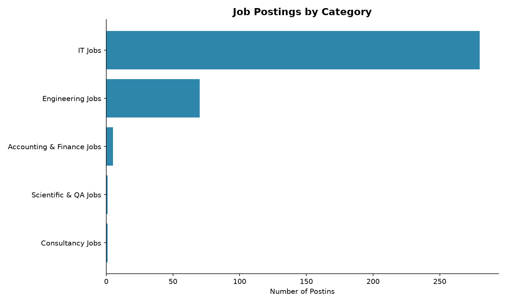

# d_classified

An end‑to‑end analytics engineering project demonstrating modern ingestion, orchestration, transformation, history tracking, and metric modeling for job postings sourced from the Adzuna API.

## Architecture Overview

```text
Adzuna API
    ↓
Python Ingestion (scripts.ingest)
    ↓
Snowflake → RAW.POSTINGS
    ↓
dbt Staging → Cleaned & Typed Records
    ↓
dbt Intermediate → Deduplicated + Enriched
    ↓
dbt Snapshot → SCD2 History Tracking
    ↓
dbt Intermediate → Current Valid Records
    ↓
dbt Marts → Analytics-Ready Tables
    ↓
MetricFlow Semantic Layer → Metrics (avg_salary, active_postings)
```

* **Orchestrated via Airflow** (daily schedule).

---

## What This Project Demonstrates

* Ingestion of job postings from Adzuna via a packaged Python module
* Orchestration with Airflow using a daily DAG
* Warehouse modeling in Snowflake across raw → staging → intermediate → marts
* SCD Type 2 history tracking via dbt snapshots
* Semantic metrics defined in MetricFlow
* Data quality enforcement with dbt tests + pytest
* CI/CD validating Python + dbt builds on every push
* Modern Python packaging using `pyproject.toml` + editable installs

---

## Tech Stack

| Category | Tooling / Technologies |
| :--- | :--- |
| **Ingestion** | Python 3.12, `requests`, `pandas`, `python-dotenv` |
| **Orchestration** | Apache Airflow |
| **Warehouse** | Snowflake |
| **Transformation** | dbt 1.11.2, Jinja2, MetricFlow |
| **Testing** | pytest, dbt tests |
| **Code Quality** | ruff |
| **Task Runner** | Make |
| **CI/CD** | GitHub Actions |
| **Packaging** | `pyproject.toml` + `pip install -e .` |

---

## Quick Start

### 1. Install Dependencies
```bash
make install
```
Installs Python dependencies, your packaged ingestion module, and dbt dependencies.

### 2. Run Ingestion Manually
```bash
python scripts/ingest.py
```
Fetches job postings from Adzuna and loads them into: `D_CLASSIFIED.RAW.POSTINGS`

### 3. Run Ingestion via Airflow
The `d_classified_ingest` DAG runs daily. Start Airflow locally:

```bash
airflow standalone
```
Your packaged ingestion module is imported via:

```python
from scripts.ingest import run_ingest
```

### 4. Run dbt Transformations
```bash
dbt run --select stg_postings+
dbt snapshot --select snap_postings
dbt build
```

### 5. Query Metrics
```bash
mf query --metrics avg_salary --group-by metric_time__day
mf list metrics
```

### 6. Generate Visualizations
```bash
python scripts/visualize.py
```
Outputs charts to `assets/`.

### 7. All Commands
```bash
make help
```

---

## Visualizations

### Job Postings by Category


---

## Project Structure

```text
d_classified/
├── airflow/
│   └── dags/
│       └── d_classified_ingest.py      # Airflow DAG
├── scripts/
│   ├── ingest.py                       # Python ingestion module
│   └── visualize.py                    # Chart generation
├── models/
│   ├── staging/
│   ├── intermediate/
│   ├── marts/
│   └── snapshots/
├── assets/
│   └── postings_by_category.png
├── tests/
│   ├── test_ingest.py
│   └── models/
├── pyproject.toml                      # Packaging metadata
├── Makefile
├── dbt_project.yml
└── requirements.txt
```

---

## Key Features

### Deduplication Before History Tracking
Raw data may contain multiple captures of the same posting. `int_postings_deduplicated` ensures:
* One row per `posting_id`
* Latest capture wins
* Snapshot receives clean, stable input

This prevents snapshot churn and ensures accurate SCD2 history.

### SCD Type 2 Snapshot
Tracks changes to:
* `salary_min`
* `salary_max`
* `description`

Snapshot fields:
* `dbt_valid_from`
* `dbt_valid_to`
* `dbt_scd_id`

This enables point‑in‑time analysis of job posting evolution.

### Multi‑Layer dbt Modeling
* **Staging:** Cleaning + casting
* **Deduplicated:** One row per posting
* **Snapshot:** Historical versions
* **Current:** Active postings
* **Enriched:** Computed fields
* **Marts:** Facts, dimensions, aggregates

### Semantic Layer Metrics
Defined once, queryable everywhere:
* `avg_salary`
* `active_postings`

Example:
```bash
mf query --metrics avg_salary --group-by metric_time__day
```

### Data Quality
* **dbt tests:** Uniqueness, not‑null, freshness
* **pytest:** Ingestion logic + Snowflake write mocks
* **ruff:** Linting + formatting

### CI/CD
* Python lint + pytest
* dbt build validation

*Failures block merge.*

---

## CI Requirements (`requirements-ci.txt`)

To ensure stable and conflict‑free CI builds, this project uses a separate dependency file for GitHub Actions: `requirements-ci.txt`. This file contains only the dependencies needed for CI, avoiding Airflow’s heavy dependency tree and its protobuf conflicts with dbt.

### Included in CI:
* **`dbt-core`, `dbt-snowflake`, `metricflow`:** For running `dbt deps` and `dbt build` during CI.
* **`pandas`, `requests`, `python-dotenv`:** Required for testing the ingestion module (`scripts/ingest.py`).
* **`pytest`:** Runs ingestion unit tests.
* **`ruff`:** Performs linting during CI.

### Not included in CI:
* **Apache Airflow:** Airflow pulls in `googleapis-common-protos<5`, which conflicts with dbt’s `protobuf>=6` requirement. Airflow is only needed for local DAG execution — not for CI.

### CI Installation Flow
GitHub Actions installs CI dependencies using:

```bash
pip install -r requirements-ci.txt
pip install -e .
```

This ensures:
* dbt builds run cleanly
* Ingestion tests import your packaged module
* Linting and unit tests run without dependency conflicts
* CI stays fast, stable, and reproducible

---

## Documentation

Generate dbt docs:

```bash
dbt docs generate
dbt docs serve
```

Includes:
* Lineage graph
* Model documentation
* Tests & freshness

---

## Notes & Environment Setup

* Requires Snowflake + Adzuna API credentials in `.env`
* **Raw Data:** `D_CLASSIFIED.RAW.POSTINGS`
* **Transformed Data:** `D_CLASSIFIED.STAGING` / `INTERMEDIATE` / `MARTS`
* **Snapshots:** `D_CLASSIFIED.SNAPSHOTS`
* See `requirements.txt` for pinned dependencies.